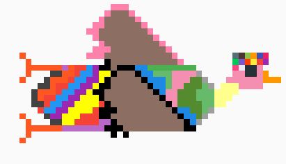

# g00s3_life
A spinoff of Duck Life's flying game mode created by Meredith Alley, Aaron Codrington, and Gabe Zak

# Goal of project:
The goal of this project was for us to relive the best days of middleschool playing Duck Life during class. 
We all love the original Duck Life game and decided we would like to replicate the flying game mode using python.
This project served as a great way to improve our coding prowess and satiated our nostalgia.

# Sprite Gallery:

 \
 \
 \
 \

# required Packages:
~~~
pip install pygame

pip install random

pip install sys

~~~

# Installation/use instructions:
The main installation required for this project is conda python (3.8). This can be installed using the following link: 
https://docs.conda.io/projects/conda/en/latest/user-guide/install/

This project also requires pygame, which can be installed from https://www.pygame.org/wiki/GettingStarted

Clone the Repo
run the foloowing command in a terminal to clone repo: 
~~~
git clone https://github.com/olincollege/g00se_life
~~~

once the repo is cloned simply cd into it and type python mainloop.py into the terminal in order to start the game.

# Video of project:
(insert video link here)

# About the team:

## Aaron:
Aaron "should've went to art school" Codrington likes to spend his time drawing, gaming, relaxing with his cat, and working on the weekends.

Fun fact: Aaron really loves learning languages. He has studied french for 7 years and is studying japanese next year.

Quote: "PLEEEEEEEEASSSSE" -Aaron 2022

## Meredith:
Meredith "Should've stayed in middle school" Alley is currently **DEVELOPING** her interest in game design _yall see what i did there ;) **DEVELOPING** get it_.

Fun fact: My two younger sisters are planning on going to Wellesley and Babson,respectively.

Quote:"So it Goes" - Meredith 2022

## Gabe: 
Gabe "Mr.Nissan" Zak enjoys racing, working on his car, gaming, and spending time with friends/family.
working hard towards a mechanical engineering degree

Fun fact: Gabe the type of homie to look you dead in the eye and come up with a word that doesn't exist, yet you somehow know exactly what it means.

Quote: "ayo they dropped dinner early today" "Zamn" -Gabe 2022